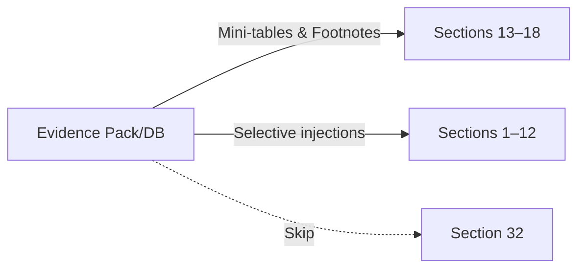

## Competitive Web Search App (Standalone, Integrable with PD2)

### Purpose
A standalone app (under `src/`) that discovers competitors per market cell, retrieves and grounds comparable metrics from high‑trust web sources, normalizes and stores them with provenance, ranks relative strengths/weaknesses, and proposes strategy bundles. Later, PD2 can consume its “Competitive Evidence Pack” to enrich Sections 13–18 (and selectively 1–12), excluding Section 32.


### Operating Modes
1. Standalone CLI
   - Prompts for Company Name (and optional scope hints). Produces a DB + Evidence Pack (markdown + JSON manifest).
2. PD2‑Integrated (later)
   - Uses PD2’s inferred company name; retrieves latest Evidence Pack/DB for prompts and mini‑tables.


## Architecture Modules

1) Identity & Market Mapper
- Input: Company name; optional hints (products/services, geographies, customer segments).
- Output: Dynamic “market cells” = (product/service) × (geo) × (customer segment).
- Materiality principles: include cells if core metrics (users or revenue) ≥ 20% OR forward value creation/destruction ≥ 33%; always allow operator‑flagged strategic cells.
- Sources (principled hierarchy): regulators/official registries; company filings/IR/annual reviews; industry associations/statistical agencies; reputable research with citations; official company sites/press for unlisted; never unsourced aggregators.

2) Peer Discovery
- Input: Market cell.
- Output: Direct peers only (default), with presence evidence and trust/recency scores; cap final peers to Top 3 per cell by evidence score (operator can override).
- Entity resolution principle: resolve brands/subsidiaries/JVs to parent; for JVs, resolve to controlling shareholder; treat sub‑brands separately only if they compete distinctly in that cell.

3) Metric Ontology & Selector
- Capability definition (principle): a repeatable, advantage‑generating capacity that produces durable KPI deltas in the market cell (e.g., cost position, customer economics, quality/coverage, asset intensity, innovation/regulatory positioning). We do not fix lists; we enforce capability coverage and metric diversity.
- Selector: For each material cell, pick 6–10 comparable metrics (prefer 3–5 high‑impact) spanning capability coverage; store definition notes.

4) Search & Grounding Engine
- Mechanism: Gemini API with `google_search` tool. Use Gemini 2.5 Flash for grounded search; fallback to 2.0 Flash if needed; do not use Lite for web grounding. Other pipeline steps may use Lite.
- Output: Grounded facts with `groundingMetadata` (webSearchQueries, URIs/titles via groundingChunks, citation spans via groundingSupports).
- Volume controls: Per‑cell and per‑metric budgets; domain filtering; early‑stop once two high‑trust comparable sources agree or deltas stabilize.

5) Extraction & Normalization
- Extraction: Parse values, units, periods, scope; store verbatim quote/table snippet for audit.
- Normalization principles: spot FX from a reputable source (logged); period alignment (prefer TTM; also store latest FY/quarter as needed); scope alignment to the cell when available, else fallback ladder with comparability note (segment×geo → segment → geo → consolidated); comparability class (Exact/Adjusted/Proxy); concise normalization notes (JSON).

6) Scoring & Prioritization
- Materiality first: filter and rank by contribution to value creation/destruction (≥ 33%) and core metrics (≥ 20%).
- Differentiation: delta vs anchor (default best‑in‑class; operator can choose nearest peer/regional leader/median).
- Impact: map to value drivers (margin/ROCE/growth/scalability); elasticities are adjustable per sector.
- Confidence: source trust × recency (≤ 24 months) × cross‑source consistency × comparability tier.
- Addressability: exclude levers not actionable within 12 months (assume no capital constraints otherwise).
- Composite priority used for fine ordering after materiality.

7) Strategy Bundler
- Feasibility‑first, synergy‑aware: build a capability–metric graph to avoid conflicting levers and surface reinforcing ones.
- Output: Top 3 viable bundles per cell; each includes mechanism, required enablers, expected KPI shifts (ranges), risks, and feasibility (meets 12‑month actionability).

8) Storage Layer
- Recommendation: SQLite for MVP simplicity; can migrate to DuckDB if analytical load increases.
- Core DB: relational core + small JSON fields for flexibility.
- Cached sources: `peer_sources/` with snapshots (PDF/HTML) and `manifest.json` (provenance, queries, timestamps, FX source/time).

9) Exporters
- Evidence Pack (markdown): peers and compact benchmark tables per cell + footnotes.
- JSON manifest: fetched items, selected metrics, anchors, scoring inputs.

10) Config & Policy
- Materiality thresholds: 20% on core metrics (users/revenue); 33% for forward value creation/destruction; operator can flag strategic cells.
- Domain policy (principles): prefer primary/regulatory; then associations/statistical agencies; accept official company sites for non‑publics; include reputable research only with citations; exclude blogs/unsourced aggregators; always log provenance and confidence.
- Model policy for search: use 2.5 Flash for grounding; fallback 2.0 Flash; never Lite for search.

11) Logging & Auditability
- Persist webSearchQueries, URIs/titles, citation spans; store hashes of cached artifacts; keep timing and rate‑limit logs.


## API / Module Contracts (Standalone Library)

All functions are Python‑style signatures (design contract; not code).

### Identity & Market Mapping
- `build_market_map(company_name: str, hints: Optional[Dict]) -> MarketMap`
  - MarketMap.fields: `cells: List[MarketCell]`, `materiality_basis: Dict`, `notes: str`
- `MarketCell`: `{ id, product_service, geography, customer_segment, materiality_score, strategic_flag }`

### Peer Discovery
- `discover_peers(cell: MarketCell, budget: SearchBudget) -> CandidatePeers`
  - `CandidatePeers`: `{ list: List[Peer], evidence: List[SourceRef], rationale: str }`
- `approve_peers(cell_id: str, selected_peer_ids: List[str]) -> Peers`
- `Peer`: `{ id, name, parent, region, presence_score, notes }`

### Metric Selection
- `propose_metrics(cell: MarketCell, target_coverage: MetricCoverage) -> ProposedMetrics`
  - `ProposedMetrics`: `{ metrics: List[Metric], coverage: CoverageReport, diversity_ok: bool }`
- `Metric`: `{ id, name, family, unit_hint, directionality, definition_version }`

### Grounded Fact Retrieval
- `fetch_grounded_facts(cell: MarketCell, peer: Peer, metric: Metric, policy: SearchPolicy) -> List[GroundedFact]`
  - `GroundedFact`: `{ value, unit, period, scope, quote, citations: List[Citation], queries: List[str], comparability_class, normalization_notes }`
- `Citation`: `{ uri, title, span: {start,end,text}, source_type, date }`
- `SearchPolicy`: `{ model: str, max_requests:int, allowed_domains: List[str], min_recency: date }`

### Normalization & Storage
- `normalize_facts(facts: List[GroundedFact], currency: str, period_policy: PeriodPolicy) -> List[Observation]`
  - `Observation`: `{ subject_id, market_id, metric_id, value, normalized_value, currency, unit, period, scope, comparability_class, normalization_notes }`
- `persist_observations(observations: List[Observation], citations: List[Citation], manifest: Manifest) -> StoreResult`

### Scoring & Bundling
- `score_cell(subject_id: str, cell_id: str, anchor: AnchorPolicy) -> ScoredCell`
  - `AnchorPolicy`: `{ mode: 'best_in_class'|'nearest_peer'|'regional_leader'|'median', peer_id?: str }`
  - `ScoredCell`: `{ metric_scores: List[MetricScore], priority_ranking: List[PriorityItem] }`
- `bundle_strategies(subject_id: str, cell_id: str) -> List[StrategyBundle]`
  - `StrategyBundle`: `{ name, mechanisms, enablers, expected_kpi_shifts, risks, feasibility }`

### Exports
- `export_evidence_pack(run_id: str, style: ExportStyle) -> Paths`
- `latest_pack(company_name: str) -> Paths`

### Data Schemas (DB tables)
- `companies(id, name, ticker, sectors)`
- `markets(id, type, product_service, geography, customer_segment, descriptors)`
- `company_markets(company_id, market_id, materiality_score, strategic_flag)`
- `competitors(id, name, parent, region)`
- `peers(cell_id, competitor_id, presence_score, evidence_json)`
- `metrics(id, name, family, unit, directionality, definition_version)`
- `observations(id, subject_id, market_id, metric_id, value, unit, period, scope, currency, normalized_value, comparability_class, normalization_notes_json)`
- `sources(id, url, title, type, date, trust_score, cached_path, hash)`
- `obs_sources(observation_id, source_id)`
- `scores(subject_id, market_id, metric_id, differentiation, impact, confidence, addressability, composite)`
- `capabilities(id, name, category)`; `capability_scores(subject_id, market_id, capability_id, score)`
- `bundles(id, subject_id, market_id, name, config_json, feasibility, expected_impacts_json)`
- `manifests(id, run_id, company_id, created_at, queries_json, policies_json)`

### Errors & Policies
- Soft failures: Return partial results with warnings and reduced confidence.
- Hard failures: SearchLimitExceeded, LowComparability, NoTrustedSources; suggest remediation (fallback URLs, operator‑provided sources).


## Prompt Library (Approach & Templates)

General guardrails:
- Always cite sources with URLs and dates; prefer primary filings, regulators, and industry bodies.
- Use precise definitions; avoid mixing time periods; if comparability is partial, add a comparability note.
- Keep outputs concise and numeric; do not speculate beyond the sources.

1) Market Cell Discovery
- System intent: “Identify material market cells for [Company], decomposed by product/service, geography, and customer segment. Use company docs and authoritative listings. Propose cells with a one‑line rationale and materiality estimate; exclude cells contributing <10% unless management flags them as strategic.”
- When used with `google_search`: ask for authoritative rosters (e.g., operator lists) per geography and product line.

2) Peer Discovery per Cell
- Prompt: “For the market cell [X], list direct competitors with presence evidence (license/share/listing) from high‑trust sources. Return 5–7 candidates with sources; note entity normalization (subsidiaries to parent). Mark top 3 as most likely direct competitors.”

3) Metric Pack Selection
- Prompt: “For cell [X], propose a metric pack (6–10) spanning capability families: scale/footprint, cost position, pricing power, quality/coverage, customer economics, asset intensity, capital efficiency, innovation cadence, regulatory position. Ensure comparability.
Return: metric name, definition, unit, directionality, likely data sources. Avoid duplicates.”

4) Grounded Metric Retrieval
- Prompt: “Find authoritative, recent, comparable values for [metric] for [Company] and peers [List] in [cell]. Prefer filings/regulators/industry bodies. Return concise facts only, each with citation and period/scope. If definitions differ, include a comparability note.”
- Tooling: Enable `google_search`. Use models: Gemini 2.5 Flash or 2.0 Flash.

5) Normalization Check
- Prompt: “Normalize these observations to common unit, period (FY/TTM/quarter), and scope (consolidated/segment). Identify comparability issues (exact/adjusted/proxy) and note any normalization steps taken.”

6) Anchor Selection
- Prompt: “Given the selected peers and metrics, recommend a benchmark anchor (best‑in‑class, nearest peer, regional leader, or median) with rationale. Default to best‑in‑class unless comparability issues suggest otherwise.”

7) Strengths/Weaknesses & Priority
- Prompt: “Compute differentiation (delta vs anchor) and map to margin/ROCE/growth/scalability using sector elasticities. Score confidence and addressability. Rank top strengths to exploit and weaknesses to mitigate, with 1–2 sentences each.”

8) Strategy Bundles
- Prompt: “Propose 2–3 strategy bundles for [cell] that jointly address top weaknesses while preserving strengths. For each: mechanism of advantage, required enablers, expected KPI shifts (ranges), time/capex implications, and risks.”


## Operator Workflows (Graphical)

```mermaid
flowchart TD
  A[Start: Company Name] --> B[Build Market Map]
  B --> C{Material Cells >= 10% or Strategic?}
  C -- No --> B
  C -- Yes --> D[Peer Discovery per Cell]
  D --> E[Operator Approves Peers]
  E --> F[Metric Pack Proposal]
  F --> G[Operator Confirms Metrics]
  G --> H[Grounded Search per Metric (google_search)]
  H --> I[Extraction & Normalization]
  I --> J[Scoring: Diff/Impact/Conf/Addr]
  J --> K[Strategy Bundling]
  K --> L[Persist DB + Cache Sources]
  L --> M[Export Evidence Pack (md + json)]
  M --> N[Done / PD2 Integration]
```

Alternate ASCII (if Mermaid not rendered):

```
Start -> Build Market Map -> [Filter Material Cells] -> Peer Discovery -> Approve Peers ->
Metric Pack -> Confirm Metrics -> Grounded Search -> Extract & Normalize -> Score ->
Bundle Strategies -> Persist -> Export Evidence Pack -> Done/PD2
```

### Per‑Cell Grounded Retrieval Loop
```mermaid
sequenceDiagram
  participant CLI
  participant Search as Grounded Search (Gemini+google_search)
  participant DB as Storage
  CLI->>Search: Query metric X for Company & Peers in Cell Y
  Search-->>CLI: Facts + citations + queries + spans
  CLI->>CLI: Normalize units/period/scope; set comparability
  CLI->>DB: Save observations + sources + manifest
  CLI->>CLI: Early stop when 2 high‑trust comparable sources found
```

### PD2 Integration Handoff



## Sequencing & Performance
1. Run market mapping and material cells early (after PD2 loads documents and extracts the company name). Parallelize section analysis and competitor app; inject only high‑confidence compact snippets into early sections; heavier use in 13–18.
2. Search budgets: recommend Standard mode (3–5 queries per metric per cell; early‑stop after two high‑trust comparable sources agree). Use Conservative mode for low‑impact cells; Aggressive mode for sparse/private cells.
3. Prefer 2.5 Flash for grounded search; 2.0 Flash acceptable; avoid Lite for search.


## Roadmap / Phasing
1. Phase 1 (MVP): CLI, market map, peer approval, initial metric families, DB + Evidence Pack export.
2. Phase 2: Full metric diversity, robust normalization, scoring & bundling, operator review screens.
3. Phase 3: PD2 integration, anomaly‑triggered fetches, sector baseline packs, richer operator tooling.


## Compliance & Provenance
1. Respect robots.txt; avoid paywalls; quote minimally with attribution.
2. Persist queries, URIs, titles, citation spans, cached snapshots with timestamps and hashes; log FX source/time when used.
3. Provide an audit trail per observation (who/when/why; normalization steps); minimal versioning via run manifest per run.

## Storage & Interface Choices
1. Stable IDs: auto‑generated for companies, market cells, peers, metrics to support merges and versioning across runs.
2. Schema flexibility: default to Option A (lean relational + small JSON notes). Option C (hybrid with views) remains available if analytics grow.
3. Evidence Pack presentation in markdown for PD2; DB/JSON remains the source of truth and enables optional programmatic access.

